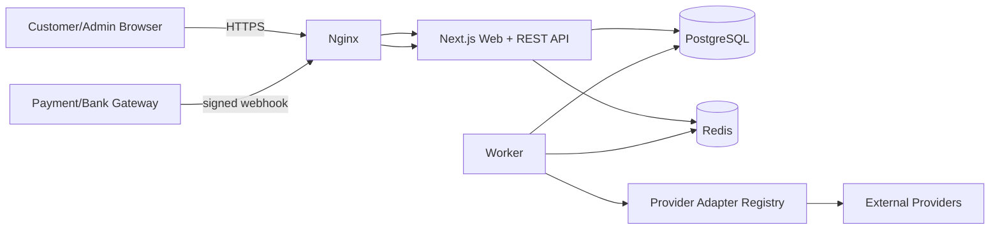
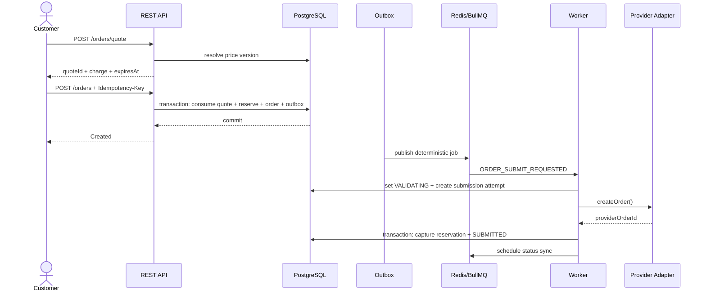

# Tương Tác Pro — Architecture

## 1. Kiến trúc được chọn

Giữ stack ưu tiên của dự án:

- Next.js App Router + TypeScript.
- Tailwind CSS + shadcn/ui (chưa triển khai UI ở checkpoint này).
- PostgreSQL.
- Prisma.
- Auth.js.
- Zod.
- REST API.
- Docker + Nginx.

Bổ sung:

- Redis: queue, rate limiting và distributed coordination ngắn hạn.
- BullMQ: async jobs/provider polling/retry.
- Dedicated Node.js worker process.
- Transactional Outbox trong PostgreSQL.

Không chuyển backend sang NestJS. Với scope hiện tại, Next.js Route Handlers làm HTTP boundary; business logic nằm trong package domain/service riêng nên không bị khóa vào framework. Nếu sau này API/worker mở rộng rất lớn, domain packages có thể được chuyển sang một API service riêng mà không viết lại core business rules.

## 2. System context



## 3. Boundary quan trọng

```text
Frontend
  -> REST API / Auth.js
    -> Application/Domain Services
      -> PostgreSQL + Outbox
        -> Worker
          -> Provider Adapter
            -> External Provider
```

Frontend không import provider SDK, provider API key hoặc provider URL secret. Provider adapters chỉ chạy server-side trong worker hoặc server package.

## 4. Component responsibilities

### `apps/web`

- Next.js pages/layouts.
- Auth.js endpoints/session.
- REST Route Handlers `/api/v1/*`.
- Zod input validation ở HTTP boundary.
- Permission checks.
- Gọi application services.
- Không chứa provider business logic.

### `apps/worker`

- Dispatch outbox.
- Submit order tới provider.
- Poll provider status.
- Sync provider catalog/balance.
- Process safe retries.
- Reconciliation jobs.
- Notification jobs.

### `packages/domain`

Business rules thuần server-side:

- PricingService.
- OrderService.
- WalletService.
- PaymentService.
- DepositService.
- ProviderRoutingService.
- RefundService.
- AuditService.

### `packages/providers`

- `ProviderAdapter` contract.
- Registry/factory.
- Common error taxonomy.
- Adapter capability metadata.
- Concrete adapters được thêm sau checkpoint.

### `packages/db`

- Prisma schema/client.
- Transaction helpers.
- DB-level raw queries cần atomic conditional update.

### `packages/queue`

- Queue names.
- Job schemas.
- BullMQ setup.
- Retry/backoff defaults.

## 5. Transaction boundaries

### Nguyên tắc

Không thực hiện external HTTP request trong PostgreSQL transaction.

### Create order transaction

Trong một transaction:

1. Lock/consume quote bằng condition.
2. Kiểm tra quote chưa hết hạn.
3. Atomically reserve wallet funds.
4. Create `orders` status `CREATED`.
5. Create `wallet_reservations`.
6. Create initial `order_logs`.
7. Create `outbox_events(ORDER_SUBMIT_REQUESTED)`.
8. Commit.

Sau commit, API trả order cho client. Outbox dispatcher đảm bảo job vẫn được publish ngay cả nếu Redis tạm thời down.

### Provider acknowledgement transaction

Sau khi provider trả về một provider order ID hợp lệ:

1. Update provider submission attempt.
2. Attach provider order ID vào order.
3. Capture reservation:
   - decrement `reserved_minor`.
   - decrement `balance_minor`.
   - append `wallet_transactions(ORDER_DEBIT)`.
4. Set order `SUBMITTED`.
5. Write order log.
6. Create next outbox event/status poll schedule if needed.

Nếu provider từ chối rõ ràng trước khi tạo order, release reservation và set `FAILED`.

Nếu kết quả provider call không xác định, không capture và cũng không release reservation; `provider_submission_state=UNKNOWN`, order giữ ở `VALIDATING`, sau đó reconciliation/manual review xử lý.

## 6. Transactional Outbox

### Vấn đề cần giải quyết

Nếu API commit order vào PostgreSQL rồi `queue.add()` thất bại vì Redis down, order có thể bị kẹt vĩnh viễn. Nếu queue trước rồi DB rollback, worker có thể chạy một job không tồn tại.

### Giải pháp

- Business transaction luôn ghi `outbox_events` cùng commit.
- Dispatcher query các event chưa publish bằng `FOR UPDATE SKIP LOCKED`.
- Enqueue BullMQ với deterministic `jobId=outbox-<eventId>`.
- Sau enqueue thành công, set `publishedAt`.
- Consumer vẫn idempotent; không coi Redis uniqueness là lớp bảo vệ duy nhất.

## 7. Order create sequence



## 8. Price architecture

### Source of price

- `provider_services.provider_rate`: latest import cost from provider.
- `pricing_rules`: current business pricing configuration.
- `service_price_versions`: immutable computed sell price snapshots.
- `order_quotes`: short-lived user quote.
- `orders`: references quote/price version and stores redundant financial snapshot for audit/reporting.

### Anti-TOCTOU

Frontend never sends “charge=10000” and expects backend to trust it. Frontend sends `serviceId`, `quantity`, target to quote endpoint. Backend computes charge. Create order must reference `quoteId`.

## 9. Provider routing

Một internal service có thể có nhiều candidate provider services:

```text
service
  -> service_provider_routes(priority=1)
     -> provider_service A
  -> service_provider_routes(priority=2)
     -> provider_service B
```

Automatic fallback chỉ được dùng khi chưa tạo side effect ở provider trước. Nếu submit tới provider A có kết quả `UNKNOWN`, tuyệt đối không fallback sang B cho tới khi reconciliation chứng minh A không tạo order.

## 10. Auth architecture

- Auth.js + Prisma Adapter.
- Database session thay vì purely stateless JWT để hỗ trợ revoke/disable user nhanh.
- Secure, HttpOnly, SameSite cookie.
- `users.role` + permission guard.
- Admin session có shorter TTL và 2FA requirement trước production.
- Custom register/password reset endpoints nằm ngoài adapter models nhưng dùng cùng user identity.

## 11. Suggested project structure

```text
tương-tác-pro/
├─ apps/
│  ├─ web/
│  │  ├─ src/
│  │  │  ├─ app/
│  │  │  │  ├─ (public)/
│  │  │  │  ├─ (customer)/
│  │  │  │  ├─ admin/
│  │  │  │  └─ api/
│  │  │  │     ├─ auth/[...nextauth]/route.ts
│  │  │  │     └─ v1/
│  │  │  ├─ components/
│  │  │  ├─ lib/
│  │  │  └─ server/
│  │  └─ package.json
│  └─ worker/
│     ├─ src/
│     │  ├─ workers/
│     │  ├─ schedulers/
│     │  └─ index.ts
│     └─ package.json
├─ packages/
│  ├─ db/
│  │  ├─ prisma/schema.prisma
│  │  └─ src/client.ts
│  ├─ domain/
│  │  └─ src/
│  │     ├─ orders/
│  │     ├─ wallet/
│  │     ├─ payments/
│  │     ├─ pricing/
│  │     ├─ providers/
│  │     └─ audit/
│  ├─ providers/
│  │  └─ src/
│  │     ├─ contracts/
│  │     ├─ registry/
│  │     ├─ errors/
│  │     └─ adapters/
│  ├─ queue/
│  ├─ validation/
│  ├─ config/
│  └─ observability/
├─ infra/
│  ├─ docker/
│  └─ nginx/
├─ docs/
│  ├─ PROJECT_SPEC.md
│  ├─ ARCHITECTURE.md
│  ├─ DATABASE_SCHEMA.md
│  ├─ API_SPEC.md
│  ├─ USER_FLOW.md
│  ├─ ADMIN_FLOW.md
│  ├─ PROVIDER_ARCHITECTURE.md
│  ├─ SECURITY_PLAN.md
│  ├─ ROUTES.md
│  └─ DEVELOPMENT_PLAN.md
├─ tests/
│  ├─ integration/
│  ├─ contract/
│  └─ e2e/
├─ docker-compose.yml
├─ pnpm-workspace.yaml
└─ package.json
```

## 12. Logical runtime topology

```text
nginx
  -> web (Next.js)
  -> worker (not public)

web + worker
  -> postgres (private network)
  -> redis (private network)

worker
  -> external provider APIs

web
  <- payment webhooks
```

PostgreSQL và Redis không expose public port trong production compose.

## 13. Observability

- JSON structured logs.
- Correlation/request ID.
- Metrics: order create rate, submission latency, provider error rate, unknown submissions, queue lag, payment confirm failures, wallet reconciliation mismatch.
- Alert ngay cho:
  - wallet mismatch.
  - payment duplicate anomaly.
  - provider unknown submission vượt threshold.
  - provider price tăng mạnh.
  - outbox backlog tăng liên tục.

## 14. Architecture Decision Records tóm tắt

| ADR | Quyết định | Lý do |
|---|---|---|
| ADR-001 | Next.js App Router + REST Route Handlers | Giữ stack người dùng ưu tiên, đủ cho BFF/API ở quy mô hiện tại |
| ADR-002 | Worker process riêng | Provider polling/retry không chạy trong request lifecycle |
| ADR-003 | PostgreSQL source of truth | Money/order consistency cần ACID |
| ADR-004 | Redis/BullMQ chỉ là async transport | Không để mất order khi Redis mất dữ liệu |
| ADR-005 | Transactional Outbox | Xóa dual-write DB/queue race |
| ADR-006 | Wallet reservation trước submit | Không overspend và không debit tiền khi provider outcome còn unknown |
| ADR-007 | Immutable wallet ledger | Audit/reconciliation |
| ADR-008 | Versioned pricing + quote | Chống price race và lưu lịch sử |
| ADR-009 | Provider adapter interface | Provider-specific API không lan vào domain |
| ADR-010 | No blind retry for non-idempotent provider create | Ngăn provider order duplication |

## Work 06 implementation note — durable provider jobs

The original blueprint recommends Redis/BullMQ + transactional outbox. Work 06 currently implements a PostgreSQL-backed durable `provider_jobs` queue because the Work 06 contract explicitly allows this strategy and it avoids an additional runtime dependency while preserving crash durability, retry state and multi-worker conditional claiming.

Current implemented boundary:

```text
Customer/API transaction
 -> orders + wallet ledger + provider_jobs (same PostgreSQL commit)
 -> dedicated apps/worker
 -> ProviderRegistry
 -> ProviderAdapter
 -> external provider
```

This is not an in-memory queue. Redis/BullMQ may be introduced later for throughput without changing the provider adapter/domain contract. Provider HTTP still never occurs in the browser or inside the customer order database transaction.
