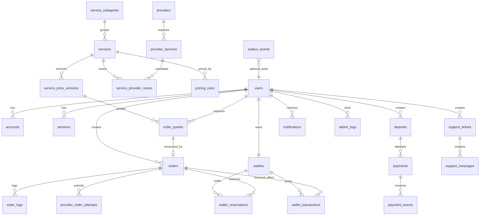

# Tương Tác Pro — Database Schema

## 1. Quy ước dữ liệu

- Primary key: UUID.
- Public IDs: chuỗi ngắn, unique, dùng ở UI/log/support.
- Timestamp: `timestamptz`, UTC.
- Wallet customer v1: VND, lưu posted amount bằng `BIGINT` để tránh floating point.
- Provider rates/FX/rate calculations: `NUMERIC(24,8)`.
- JSON payload: `jsonb`, chỉ lưu dữ liệu cần audit/debug; secret phải redact/encrypt.
- Soft delete chỉ dùng nơi business cần giữ lịch sử; không cascade xóa dữ liệu tài chính.

## 2. Core enums

```text
UserRole: CUSTOMER | SUPPORT | FINANCE | ADMIN
UserStatus: PENDING_VERIFICATION | ACTIVE | SUSPENDED | CLOSED

OrderStatus:
  CREATED | VALIDATING | SUBMITTED | PROCESSING |
  COMPLETED | FAILED | CANCELLED | PARTIAL | REFUNDED

ProviderSubmissionState:
  NOT_STARTED | QUEUED | SENDING | ACKNOWLEDGED | UNKNOWN | REJECTED

PaymentStatus: PENDING | CONFIRMED | FAILED | REFUNDED
DepositStatus: PENDING | PROCESSING | CONFIRMED | FAILED | CANCELLED | REFUNDED

WalletTransactionType:
  DEPOSIT_CREDIT | ORDER_DEBIT | ORDER_REFUND |
  ADMIN_CREDIT | ADMIN_DEBIT | PAYMENT_REFUND_DEBIT

WalletReservationStatus: ACTIVE | CAPTURED | RELEASED | EXPIRED

TicketStatus: OPEN | IN_PROGRESS | WAITING_CUSTOMER | RESOLVED | CLOSED
ProviderStatus: ACTIVE | DISABLED | DEGRADED
ServiceStatus: ACTIVE | PAUSED | DISABLED
```

## 3. ERD tổng quát



## 4. Auth tables

### `users`

| Column | Type | Notes |
|---|---|---|
| id | uuid PK | |
| public_id | varchar unique | e.g. `USR_...` |
| email | citext unique | normalized |
| email_verified_at | timestamptz nullable | |
| password_hash | text nullable | Argon2id for credentials login |
| name | varchar nullable | |
| phone | varchar nullable | normalized if used |
| avatar_url | text nullable | |
| role | enum | default CUSTOMER |
| status | enum | |
| two_factor_enabled | boolean | admin required before launch |
| session_version | int | bump to revoke all sessions |
| created_at | timestamptz | |
| updated_at | timestamptz | |
| last_login_at | timestamptz nullable | |

Indexes: `email`, `(role,status)`, `created_at`.

### `accounts`

Auth.js adapter-compatible external account table.

Key uniqueness: `(provider, provider_account_id)`.

### `sessions`

Database session records. `session_token` unique; includes `user_id`, `expires_at`.

### `verification_tokens`

Email verification/passwordless-compatible token table as required by Auth.js flows.

### `password_reset_tokens`

Custom credentials reset flow. Store token hash, not raw token.

## 5. Wallet tables

### `wallets`

| Column | Type | Notes |
|---|---|---|
| id | uuid PK | |
| user_id | uuid unique FK users | one wallet per user/currency in v1 |
| currency | char(3) | `VND` |
| balance_minor | bigint | posted balance |
| reserved_minor | bigint | active holds |
| version | bigint | optimistic/concurrency diagnostics |
| created_at | timestamptz | |
| updated_at | timestamptz | |

DB checks:

```text
balance_minor >= 0
reserved_minor >= 0
reserved_minor <= balance_minor
```

### `wallet_transactions`

Append-only posted money ledger.

| Column | Type | Notes |
|---|---|---|
| id | uuid PK | |
| wallet_id | uuid FK | |
| type | enum | |
| amount_minor | bigint | signed; credit positive, debit negative |
| balance_before_minor | bigint | audit snapshot |
| balance_after_minor | bigint | audit snapshot |
| currency | char(3) | |
| reference_type | varchar | PAYMENT / ORDER / ADMIN_ADJUSTMENT... |
| reference_id | uuid/text | business reference |
| idempotency_key | varchar unique | critical |
| reverses_transaction_id | uuid nullable | compensating link |
| metadata | jsonb | redacted |
| created_at | timestamptz | immutable |

No update/delete application permission after insert except controlled archival operations that do not alter financial meaning.

### `wallet_reservations`

| Column | Type | Notes |
|---|---|---|
| id | uuid PK | |
| wallet_id | uuid FK | |
| order_id | uuid unique FK | one active order reservation |
| amount_minor | bigint | positive |
| status | enum | ACTIVE/CAPTURED/RELEASED/EXPIRED |
| idempotency_key | varchar unique | |
| expires_at | timestamptz nullable | operational safeguard |
| captured_transaction_id | uuid nullable | points to ORDER_DEBIT |
| created_at | timestamptz | |
| updated_at | timestamptz | |

## 6. Service/catalog tables

### `service_categories`

- `id`
- `parent_id` nullable self FK
- `platform` (`FACEBOOK`, `TIKTOK`, `INSTAGRAM`, `YOUTUBE`, `THREADS`)
- `name`
- `slug` unique within platform
- `sort_order`
- `is_active`
- timestamps

### `services`

Internal sellable product, provider-neutral.

- `id`, `public_id`, `category_id`
- `name`, `slug`, `description`
- `platform`
- `unit_label`
- `rate_unit` default 1000 where appropriate
- `min_quantity`, `max_quantity`
- `supports_refill`, `supports_cancel`
- `status`
- `current_price_version_id` nullable FK
- `created_at`, `updated_at`

Unique `(platform, slug)`.

## 7. Provider tables

### `providers`

- `id`, `code` unique, `name`
- `base_url`
- `status`
- `timeout_ms`
- `rate_limit_per_second` nullable
- `config_json` non-secret config
- `last_balance_sync_at`
- `last_health_at`
- timestamps

### `provider_credentials`

- `id`
- `provider_id` unique
- `api_key_ciphertext`
- `api_key_iv`
- `api_key_tag`
- `key_version`
- timestamps

Master encryption key comes from environment/secret manager, never from DB.

### `provider_services`

Raw/normalized provider catalog item.

- `id`
- `provider_id`
- `external_service_id`
- `external_name`
- `provider_rate` numeric(24,8)
- `provider_currency` char(3)
- `rate_unit`
- `min_quantity`, `max_quantity`
- `supports_refill`, `supports_cancel`
- `is_available`
- `raw_payload` jsonb redacted
- `last_synced_at`

Unique `(provider_id, external_service_id)`.

### `service_provider_routes`

- `id`
- `service_id`
- `provider_service_id`
- `priority`
- `is_enabled`
- `auto_fallback_allowed`
- `created_at`, `updated_at`

Unique `(service_id, provider_service_id)`, unique `(service_id, priority)` where enabled by business rule.

### `provider_balance_snapshots`

Optional but recommended for cost/risk monitoring.

- provider, amount, currency, captured_at.

## 8. Pricing tables

### `fx_rates`

- `id`
- `base_currency`
- `quote_currency`
- `rate` numeric(24,8)
- `source`
- `effective_at`

### `pricing_rules`

- `id`
- `service_id`
- `provider_service_id` nullable; null = service default
- `markup_percent` numeric(10,4)
- `fixed_markup_minor` bigint default 0
- `manual_customer_rate` numeric(24,8) nullable
- `minimum_charge_minor` bigint default 0
- `rounding_mode`
- `is_active`
- `version` int
- `created_by`
- timestamps

### `service_price_versions`

Immutable sell price snapshot.

- `id`
- `service_id`
- `provider_service_id`
- `pricing_rule_id`
- `version` int
- `provider_rate_snapshot` numeric(24,8)
- `provider_currency`
- `fx_rate_snapshot` numeric(24,8)
- `markup_percent_snapshot` numeric(10,4)
- `fixed_markup_minor_snapshot` bigint
- `customer_rate_snapshot` numeric(24,8)
- `sale_currency`
- `rate_unit`
- `effective_from`
- `effective_to` nullable
- `created_at`

Unique `(service_id, version)`.

### `order_quotes`

- `id`
- `public_id`
- `user_id`
- `service_id`
- `price_version_id`
- `target_hash` optional; target can be bound to quote
- `quantity`
- `customer_rate_snapshot`
- `charge_minor`
- `currency`
- `expires_at`
- `consumed_at` nullable
- `created_at`

A quote is consumed using conditional update `WHERE consumed_at IS NULL AND expires_at > now()`.

## 9. Order tables

### `orders`

| Column | Type | Notes |
|---|---|---|
| id | uuid PK | |
| public_id | varchar unique | customer-facing |
| user_id | uuid FK | |
| service_id | uuid FK | |
| quote_id | uuid unique FK | prevents quote reuse |
| price_version_id | uuid FK | audit |
| provider_id | uuid nullable | chosen route |
| provider_service_id | uuid nullable | |
| provider_order_id | varchar nullable | external ID |
| target | text | normalized target |
| target_hash | char(64) | logs/dedupe diagnostics without exposing target |
| quantity | bigint | requested |
| start_count | bigint nullable | provider field |
| remains | bigint nullable | provider field |
| status | enum | public lifecycle |
| provider_submission_state | enum | technical sub-state |
| client_idempotency_key | varchar | |
| request_fingerprint | char(64) | diagnostic |
| charge_minor | bigint | immutable customer charge snapshot |
| refunded_minor | bigint default 0 | cumulative |
| provider_cost_estimate | numeric(24,8) nullable | snapshot |
| provider_cost_final | numeric(24,8) nullable | final if known |
| provider_currency | char(3) nullable | |
| sale_currency | char(3) | VND |
| markup_percent_snapshot | numeric(10,4) | |
| submitted_at | timestamptz nullable | |
| completed_at | timestamptz nullable | |
| cancelled_at | timestamptz nullable | |
| failed_at | timestamptz nullable | |
| created_at | timestamptz | |
| updated_at | timestamptz | |

Critical unique:

```text
UNIQUE(user_id, client_idempotency_key)
UNIQUE(provider_id, provider_order_id) WHERE provider_order_id IS NOT NULL
```

Indexes:

- `(user_id, created_at desc)`
- `(status, updated_at)`
- `(provider_id, status)`
- `(provider_submission_state, updated_at)`
- `public_id`

### `order_logs`

Append-only lifecycle/audit log:

- `order_id`
- `from_status`, `to_status`
- `event_type`
- `actor_type`, `actor_id` nullable
- `message`
- `metadata` redacted
- `created_at`

### `provider_order_attempts`

Tracks irreversible provider side effects.

- `id`
- `order_id`
- `provider_id`
- `provider_service_id`
- `action` (`CREATE`, `CANCEL`, `REFILL`)
- `attempt_no`
- `provider_idempotency_key` nullable
- `request_hash`
- `state` (`PREPARED`, `SENDING`, `ACKNOWLEDGED`, `REJECTED`, `UNKNOWN`)
- `http_status` nullable
- `provider_order_id` nullable
- `error_code` nullable
- `started_at`, `finished_at`

Unique `(order_id, action, attempt_no)` and, where supported, `(provider_id, provider_idempotency_key)`.

## 10. Deposit/payment tables

### `deposits`

- `id`, `public_id`, `user_id`
- `requested_amount_minor`
- `confirmed_amount_minor` nullable
- `currency`
- `method`
- `status`
- `reference_code` unique
- `expires_at` nullable
- timestamps

### `payments`

- `id`, `public_id`, `deposit_id`
- `gateway`
- `external_payment_id` nullable
- `amount_minor`
- `currency`
- `status`
- `idempotency_key` unique
- `confirmed_at`, `failed_at`, `refunded_at`
- `failure_code`, `failure_message`
- timestamps

Unique `(gateway, external_payment_id)` where external ID is not null.

### `payment_events`

Webhook inbox/deduplication.

- `id`
- `gateway`
- `external_event_id`
- `event_type`
- `payload_hash`
- `payload_json` redacted
- `signature_valid`
- `processed_at` nullable
- `processing_error` nullable
- `received_at`

Unique `(gateway, external_event_id)`.

## 11. Support tables

### `support_tickets`

- id, public_id, user_id
- subject, category, priority, status
- assigned_to nullable
- last_message_at
- timestamps

### `support_messages`

- id, ticket_id
- sender_user_id
- sender_role_snapshot
- body
- attachment metadata nullable
- created_at

## 12. Notifications

### `notifications`

- id, user_id
- type
- title, body
- data_json
- read_at nullable
- created_at

Index `(user_id, read_at, created_at desc)`.

## 13. Admin/audit/settings

### `admin_logs`

Append-only privileged action audit.

- id
- actor_user_id
- action
- entity_type
- entity_id
- reason nullable
- before_json redacted
- after_json redacted
- request_id
- ip_hash / ip metadata according to privacy policy
- created_at

### `system_settings`

- `key` unique
- `value_json`
- `type`
- `is_public`
- `version`
- `updated_by`
- timestamps

Không lưu API secret trong bảng này.

## 14. Reliability tables

### `outbox_events`

- `id` uuid PK
- `aggregate_type`
- `aggregate_id`
- `event_type`
- `payload_json`
- `status` (`PENDING`, `PUBLISHED`, `FAILED`)
- `attempts`
- `available_at`
- `published_at` nullable
- `last_error` nullable
- `created_at`

Index `(status, available_at, created_at)`.

### `idempotency_records` (recommended)

General REST idempotency store for mutation endpoints beyond order/payment.

- `scope`
- `actor_id`
- `idempotency_key`
- `request_hash`
- `response_status`
- `response_body`
- `expires_at`

Unique `(scope, actor_id, idempotency_key)`.

## 15. Atomic wallet operations

### Reserve

Conceptual SQL executed inside transaction:

```sql
UPDATE wallets
SET reserved_minor = reserved_minor + :amount,
    version = version + 1,
    updated_at = now()
WHERE id = :wallet_id
  AND balance_minor - reserved_minor >= :amount;
```

Exactly one row must update. Zero rows = insufficient available balance or concurrent race lost.

### Capture reservation

Lock reservation/order; if reservation is still `ACTIVE`, decrement both balance and reserved amount and create exactly one `ORDER_DEBIT` ledger row using a unique idempotency key.

### Release reservation

Only `ACTIVE -> RELEASED`; decrement `reserved_minor`, no posted wallet transaction because no money was posted.

## 16. Reconciliation queries/invariants

Nightly/periodic jobs must verify:

```text
wallet.balance_minor == SUM(wallet_transactions.amount_minor)
wallet.reserved_minor == SUM(ACTIVE wallet_reservations.amount_minor)
order.refunded_minor <= order.charge_minor
confirmed payment has exactly one deposit credit transaction
captured reservation has exactly one order debit transaction
provider order ID is unique within provider
```

Mismatch generates high-severity alert and blocks automated money actions for the affected entity until resolved.

---

## Work 04 implementation note

The concrete Prisma schema now lives at `packages/db/prisma/schema.prisma` with baseline migration `202609160001_work4_backend`.

Work 04 intentionally debits an order at creation and leaves the order `PENDING`, because no provider call exists in this Work. The earlier reservation/capture model remains the target for the provider-integration Work, where ambiguous external side effects matter. `wallets.reserved_minor` remains in the physical schema but Work 04 create-order does not reserve funds.

Work 04 VND uses PostgreSQL `BIGINT`; one stored unit equals one VND. Service rates are VND per 1,000 units and order charge is integer-ceiling arithmetic.

Database-level Work 04 protections include unique normalized email, public IDs, `(user_id, idempotency_key)` for order/deposit, money/range checks, FKs, and customer-history indexes. `WalletTransaction` remains the audit trail for every Work 04 balance change.

---

## Work 05 physical schema additions

Migration `202609160002_work5_admin` extends the accepted Work 04 schema for safe operations without introducing provider data.

### `service_categories.enabled`

Boolean operational flag. A category cannot be disabled by Admin domain logic while a referenced service remains non-DISABLED.

### `wallet_transactions` admin attribution

Adds nullable `admin_user_id` and `reason`. Admin wallet adjustments, confirmed deposits and order refunds retain the ledger as the financial audit trail; no operation writes the wallet balance without a corresponding ledger effect.

### `service_price_history`

Stores service, previous/new customer rate, admin actor, optional reason and timestamp. Price is still VND per 1,000 units using BIGINT.

### `admin_audit_logs`

Stores admin actor, action, entity type/id, redacted before/after/metadata JSON, optional IP and timestamp. Passwords/auth secrets/integration credentials are prohibited from audit payloads.

### `system_settings`

Singleton operational configuration row (`id=default`) containing site name, support email, maintenance mode, minimum deposit, order-creation toggle and support toggle. It deliberately contains no provider/payment secret.

Work 05 financial mutations use Serializable transactions/conditional state transitions for concurrency safety. Deposit confirmation and order refund are designed to have one financial effect even when requests race or replay.
