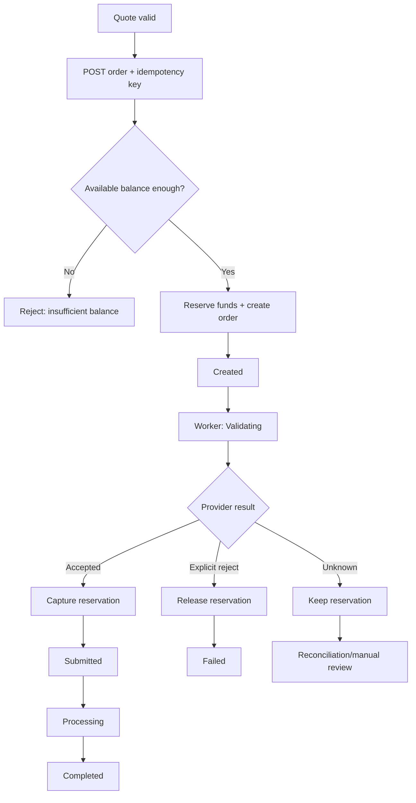

# Tương Tác Pro — User Flow

## 1. Registration/login

```text
Register
 -> verify email
 -> wallet auto-created at 0 VND
 -> login
 -> dashboard
```

Suspended user may authenticate only as needed to display account state/support policy, but cannot create quote/order/deposit mutation according to policy.

## 2. Browse services

```text
Dashboard
 -> Services
 -> choose platform/category
 -> choose service
 -> enter target + quantity
 -> request quote
```

User never selects provider. Backend routes provider.

## 3. Quote flow

1. User enters link/target and quantity.
2. Frontend calls `POST /orders/quote`.
3. Backend validates service/min/max/target shape.
4. Backend resolves current service price version.
5. Quote returns exact charge and expiry.
6. UI displays quote.
7. On submit, frontend generates one idempotency key and reuses it until request succeeds/fails definitively.

If quote expires, frontend gets `QUOTE_EXPIRED` and requests a new quote. It must not silently change price after user clicked submit.

## 4. Create order flow



## 5. Order status visible to user

### `Created`

Order đã được ghi nhận nội bộ, tiền đã được giữ nhưng chưa trừ posted balance.

### `Validating`

Worker đang xác minh route/provider/submission. Nếu provider outcome unknown, có thể ở trạng thái này lâu hơn bình thường; UI nên hiển thị thông điệp trung tính “Đang xác minh với nhà cung cấp”, không khuyến khích đặt lại cùng đơn.

### `Submitted`

Provider đã xác nhận order ID; reservation được capture và wallet debit được post.

### `Processing`

Provider đang chạy.

### `Completed`

Provider xác nhận hoàn tất.

### `Partial`

Provider hoàn thành một phần. Refund cho phần chưa thực hiện được tính theo customer price snapshot/policy và ghi ledger riêng.

### `Failed`

Provider hoặc validation thất bại xác định. Nếu chưa capture: release hold. Nếu đã capture: refund theo policy.

### `Cancelled`

Cancel được xác nhận theo capability/policy. Refund chỉ xảy ra khi điều kiện refund đã thỏa.

### `Refunded`

Toàn bộ customer charge đã được hoàn vào wallet hoặc theo refund channel được định nghĩa.

## 6. Preventing double order UX

- Disable submit button sau click chỉ là UX, không phải protection chính.
- Frontend tạo `Idempotency-Key` cho submit intent.
- Network timeout: frontend retry với cùng key.
- Backend trả lại cùng order thay vì tạo order mới.
- Nếu user chủ động muốn đặt lại một order giống hệt sau đó, frontend tạo key mới.

## 7. Wallet flow

Wallet screen hiển thị:

```text
Posted balance
Reserved amount
Available balance
```

History chỉ hiển thị posted transactions; order detail có thể hiển thị reservation state để giải thích tiền đang bị giữ.

## 8. Deposit flow

```text
Wallet -> Deposit
 -> choose method/amount
 -> create deposit intent
 -> show instructions/payment action
 -> Pending
 -> gateway/bank confirmation
 -> Confirmed
 -> wallet credit appears once
```

Nếu payment failed, deposit/payment hiển thị failed; user có thể tạo payment attempt mới theo policy.

## 9. Payment refund flow

`Confirmed -> Refunded` không đồng nghĩa “xóa wallet transaction cũ”. Hệ thống tạo compensating/debit transaction khi refund ra ngoài nếu policy yêu cầu và chỉ hoàn tất khi đảm bảo không tạo negative wallet.

## 10. Support flow

```text
Support -> New ticket
 -> subject/category/body
 -> Open
 -> staff reply
 -> Waiting customer / In progress
 -> Resolved
 -> Closed
```

Order detail có action “Tạo ticket về đơn này” bằng reference, nhưng support message không được tự động chứa provider secret/raw provider payload.

## 11. Notifications

Events nên tạo notification:

- Deposit confirmed/failed.
- Order submitted/completed/partial/failed/cancelled/refunded.
- Ticket replied/resolved.
- Security event: password changed, new login where supported.

## 12. Account management

- Profile.
- Change password.
- Active sessions/revoke.
- 2FA when enabled for customer later.
- Notification preferences future.

## 13. Important user-facing rules

- Không hiển thị provider name/cost.
- Không hứa tốc độ/order outcome ngoài dữ liệu service policy.
- Không tự retry order từ frontend khi không có idempotency key cũ.
- Không hiển thị “Failed” khi provider create outcome còn unknown.
